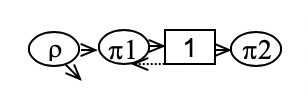
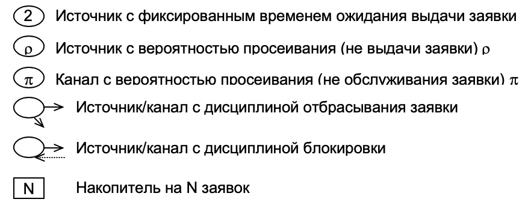

# SAaCSimLab
 Вариант 18 для 3 лабораторной работы по САиММод.

## Задание

Схема системы:

На схеме условно обозначены:

* Ротк – вероятность отказа;  
* А – абсолютная пропускная способность; 
* Wс – среднее время пребывания заявки в системе. 

|ρ|π1|π2|Цель исследования|
|---|---|---|-----------|
|0,5|0,6|0,4|Ротк, А, Wс|

q  = { 0, 1 } – количество заявок в очереди;  
π1 = { 0, 1, B } – состояние канала 1;  
π2 = { 0, 1 } – количество заявок в канале 2;  
0 – заявок нет, 1 – одна заявка, B – заблокирован;  

Общий вид кодировки состояния системы: { π1, q, π2 }
